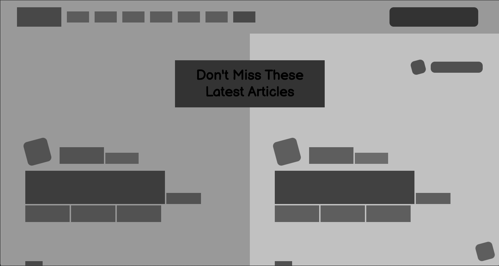

# Positioning and Floating element

> This project is a heat map of the [Smashing Magazine](https://www.smashingmagazine.com/)  home page.
> 

## Navigation bar

- The navbar consist of a logo, navigation links and a search field

## Body

- Latest articles
- Latest posts and call to action boxes
- Full width advertisement
- Community links
- Community links starts with a full width person of the week and lists the community links
- An other full width advertisement
- Our guides

## Footer

- Links to all articles on the top
- About the website content and main links of the website on the bottom

## Built With

- HTML5
- CSS3

## Getting Started

**Open index.html in the browser**

## Authors

:bust_in_silhouette: **@DejazmachMolla**

- Github: [@githubhandle](https://github.com/DejazmachMolla)
- Twitter: [@twitterhandle](https://twitter.com/DJATSS)
- Linkedin: [linkedin](https://www.linkedin.com/in/dejazmach-getachew-027aabaa/)

:bust_in_silhouette: **@m15e**

- Github: [@githubhandle](https://github.com/m15e)

## :handshake: Contributing

Contributions, issues and feature requests are welcome!
Feel free to check the [issues page](issues/).

## Show your support

Give a :star:️ if you like this project!

## Acknowledgments

- Microverse Design Teardown project.

## :memo: License

This project is [MIT](lic.url) licensed.
